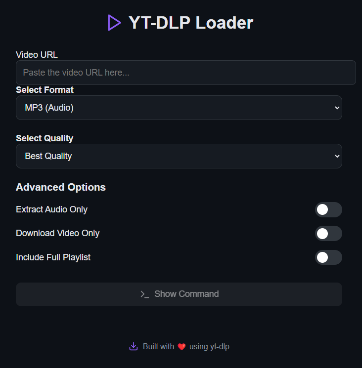
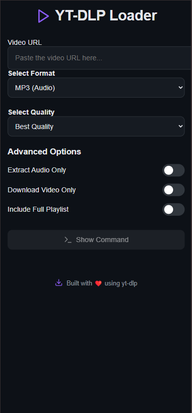

# 🎬 YT-DLP Command Generator

A modern web-based tool to generate advanced **yt-dlp** commands using a visual UI — no need to remember long CLI flags. Built with **React**, **Vite**, and **Tailwind-style CSS**. Supports audio/video format selection, quality filters, and more.


---

## ✨ Features

- 🎥 Input YouTube (or other) URLs
- ⚙️ Select output format: audio/video
- 📐 Choose quality settings (e.g. best, worst, 720p)
- 🎛️ Toggle advanced `yt-dlp` flags
- 📋 One-click copy to clipboard
- 🧼 Clean & responsive UI (desktop/mobile)
- 🧠 Built-in validation + hinting
- 🖼️ Includes screenshots for preview

---

## 🚀 Getting Started

### 📦 Install dependencies

```bash
npm install
```

### 🧪 Start development server

```bash
npm run dev
```

App will be available at: [http://localhost:5173](http://localhost:5173)

### ⚙️ Build for production

```bash
npm run build
```

---

## 📷 Screenshots

### Desktop  


### Mobile  


---

## 👨‍💻 Author

Made by **Nikola Hadzic**  
GitHub: [@hadzicni](https://github.com/hadzicni)

---

## 📄 License

This project is licensed under the MIT License. See the [LICENSE](./LICENSE) file for details.
